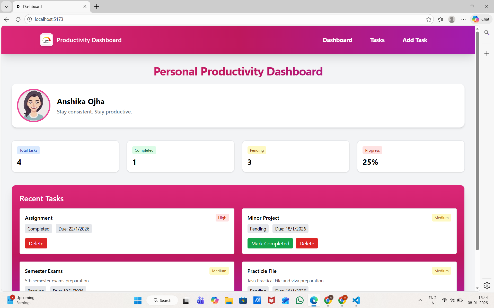
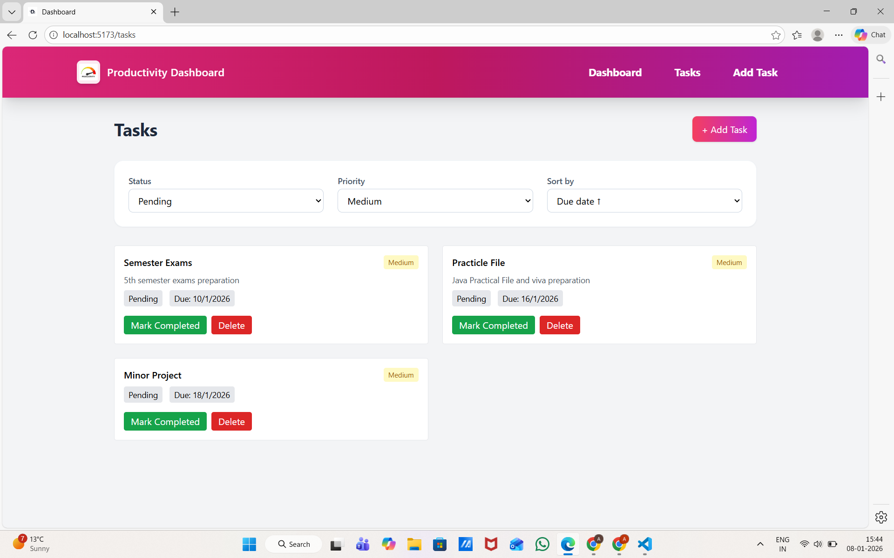
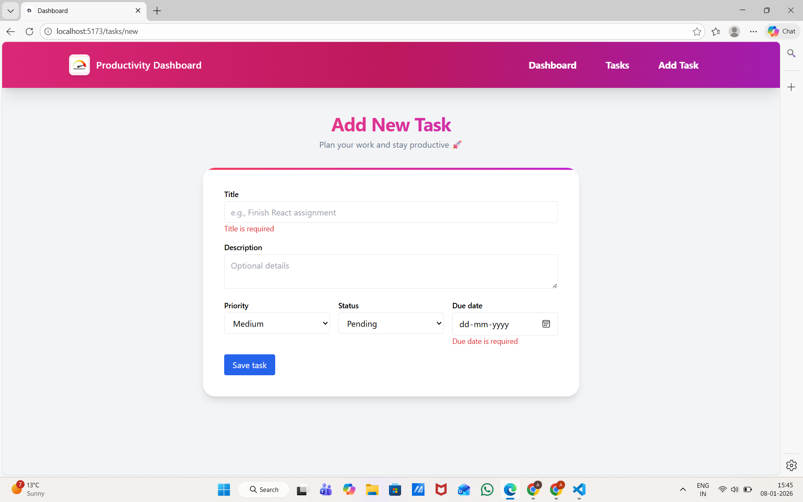

# Personal Productivity Dashboard

**Frontend Assignment – Anshika Ojha**

A modern, responsive personal productivity dashboard built using  **TypeScript**, **React**, and **Tailwind CSS**.  
The application helps users manage daily tasks, track progress, and stay organized with a clean and intuitive UI.

---

## 🚀 Tech Stack
- **React**
- **TypeScript**
- **Tailwind CSS**
- **LocalStorage** (for persistence)
- **GitHub** (version control)

---

## 🎯 Objective

To build a multi-feature productivity dashboard that demonstrates:
- Strong React fundamentals
- Component-based architecture
- Effective state management
- TypeScript usage
- Clean and consistent UI design

---

## ✨ Features

### 1️⃣ Task Management
Each task includes:
- Title
- Description
- Priority (Low / Medium / High)
- Status (Pending / Completed)
- Due Date

**Task Actions**
- Create tasks
- Delete tasks
- Mark tasks as completed
- Filter by status and priority
- Sort tasks by due date

---

### 2️⃣ Task Statistics
- Total tasks
- Completed tasks
- Pending tasks
- Progress indicator (percentage)

---

### 3️⃣ Data Persistence
- Tasks are stored in **localStorage**
- Data persists after page refresh

---

## 📄 Pages & Routes

| Route | Description |
|-----|------------|
| `/` | Dashboard (stats + recent tasks) |
| `/tasks` | Full task list with filters & sorting |
| `/tasks/new` | Add new task |

---

## 🧩 Reusable Components

- `TaskForm` – Create & edit tasks
- `TaskCard` – Display individual task details
- `StatsCard` – Display task statistics
- `Navbar` – Application navigation

---

## 🛠️ Technical Highlights

- Fully typed **TypeScript interfaces** for all data models
- Reusable, modular components
- Local state management using React hooks
- Basic form validation
- Responsive design (mobile-first)
- Clean and consistent UI across all pages

---

## 🌙 Bonus Features (Optional)
- Subtle hover
- Empty states for better UX

---


## 📸 Screenshots

### 🏠 Dashboard
Displays task statistics, progress overview, and recent tasks in a clean, card-based layout.



---

### 📋 Tasks Page
View all tasks with filtering by status & priority and sorting by due date.



---

### ➕ Add New Task
Create a new task using a structured form with validation and clear UI.




---

## 📦 Installation & Setup

```bash
# Clone the repository
git clone <repository-url>

# Navigate to the project directory
cd Personal

# Install dependencies
npm install

# Run the development server
npm run dev


